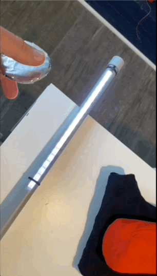
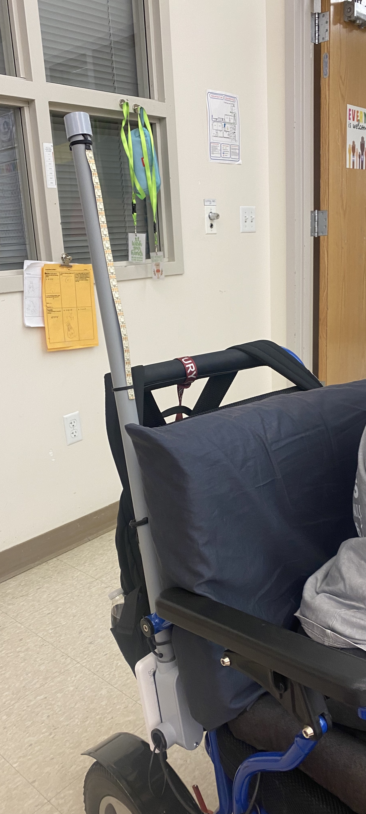
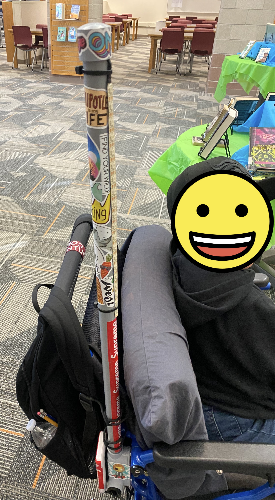
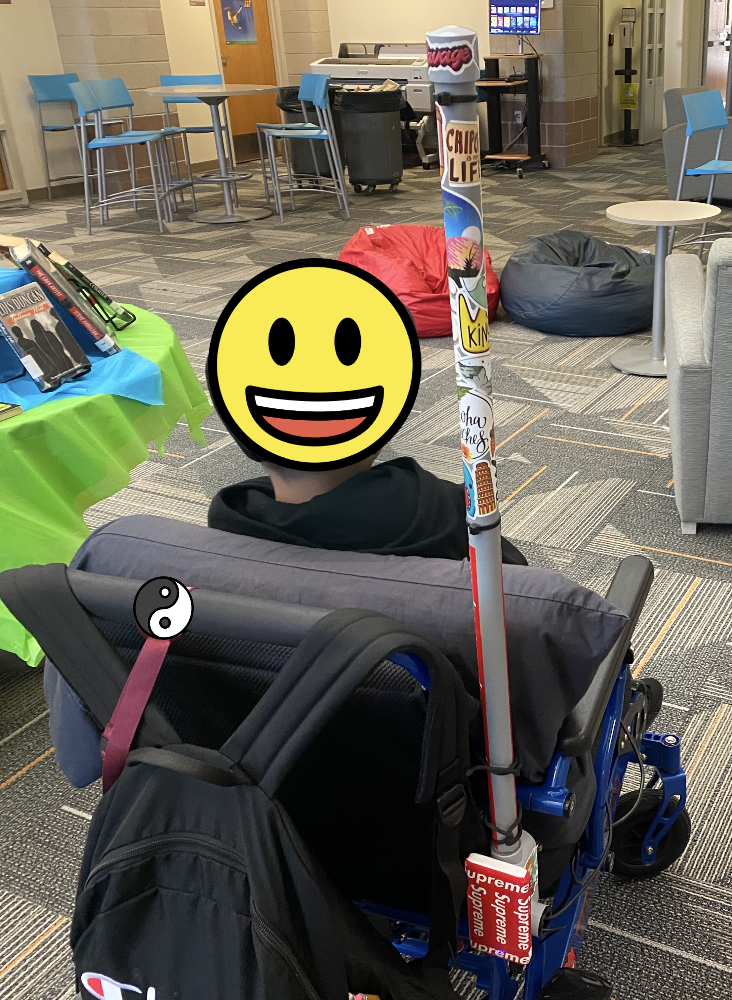
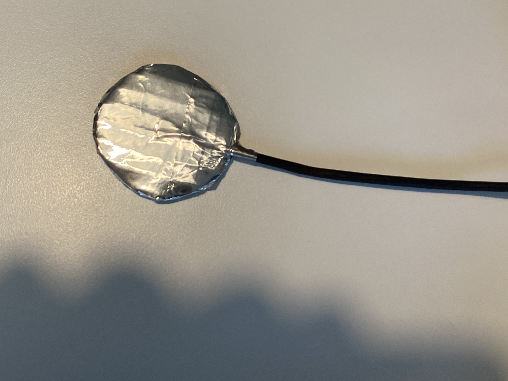
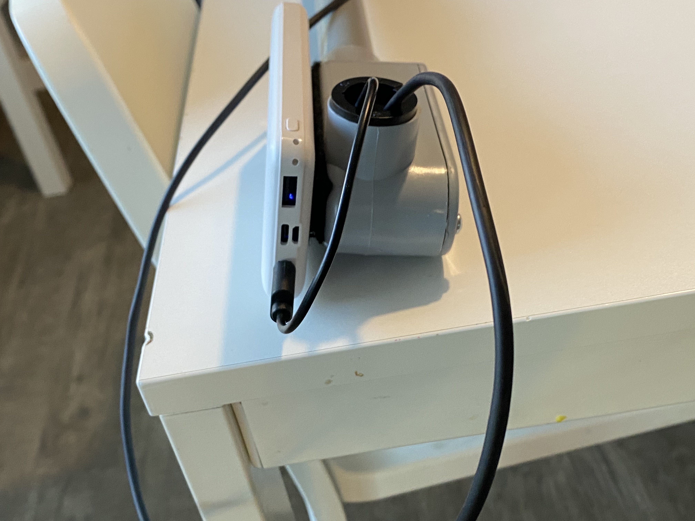
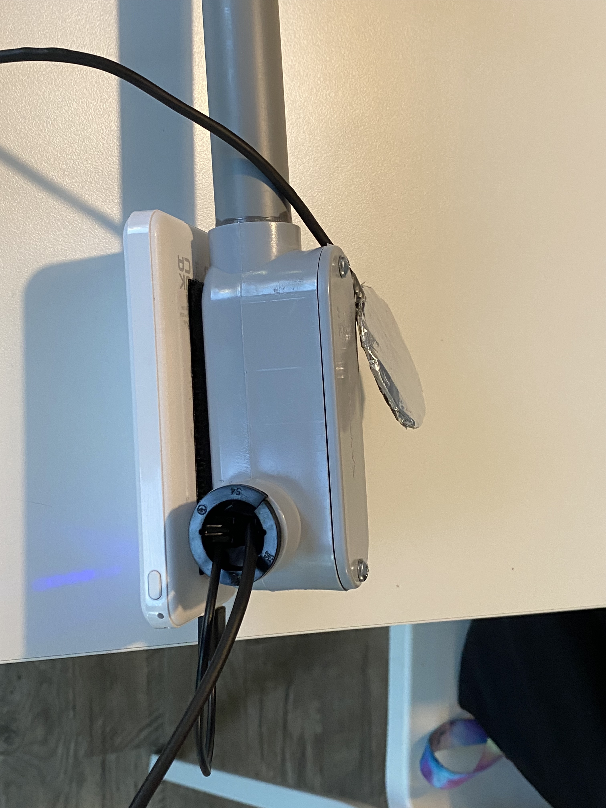
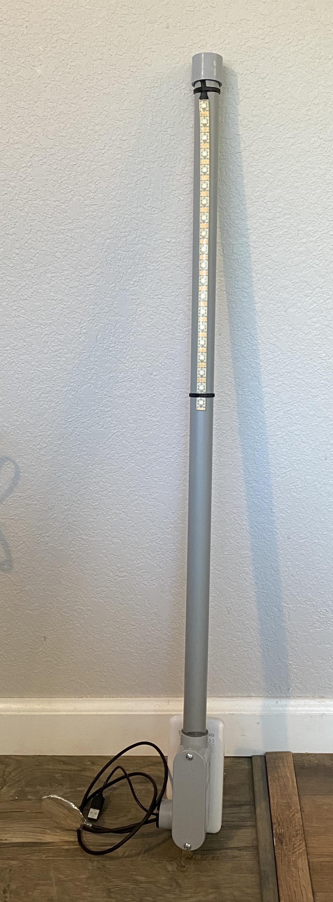
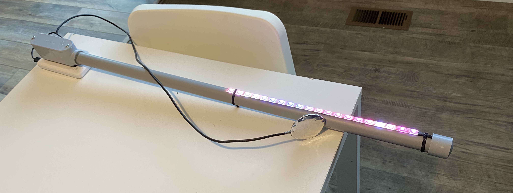
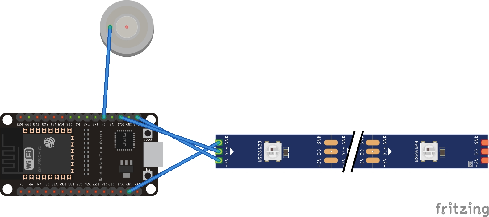

# Heads Up Light
An assistive device that allows a student to toggle a light strip on/off to call attention to them in a classroom, similar to raising a hand. Complete with rainbow effects :rainbow:

## How to use
This build used a capacitive touch pad to toggle the light off and on. The user places the touch pad in a convenient location on a wheelchair. The light assembly is attached to a support on the wheelchair with rubberized twist ties. The color pallette changes randomly on each activation of the light.

## Photos
       

## Diagram

## Materials Used
(1) ESP32 WROVER Module  
(1) WS2812B Light Strip - 20 LEDs  
(1) USB rechargeable battery pack  
(1) 3/4" PVC Conduit Tube  
(1) 3/4" PVC Conduit Body  
(1) 3/4" PVC Conduit end cap  
(1) 3/4" Conduit cable connector  
(1) Length of 18 AWG stranded wire  
(1) Velcro Strip  
(3) Lengths of 24 AWG stranded wire  
(2) Lengths of heat shrink tubing 
(2) Zip Ties  
(2) Rubberized twist ties  
4x4 sheet of cardboard  
Metal tape  
Hot Glue  
PVC Conduit Cement  

## Code Disclaimer
I am not a C++ developer, so it's not as polished as it might be from someone with more experience. The light controlling code was harvested from a previous project in this repo, light-canvas. The original animation is called 'Pacifica' located here: https://gist.github.com/kriegsman/36a1e277f5b4084258d9af1eae29bac. 

## Assembly
- Flash ESP32 with ./heads-up-light/heads-up-light.ino
- Feed USB Wiring through the conduit body outlet for battery pack. Attach to cable connector to hold in place
- Trim conduit tube to size
- Cemet conduit body to the bottom of the tube
- Cut 24 AWG stranded wire about 5 inches longer than the tube
- Tin and solder stranded wire to the indicated pins on the ESP32
- Tin and solder other ends of stranded wire to the appropriate pads on the light strip
- Tin and solder 18 AWG stranded wire to touch pin on ESP32
- Pass this wire out of the conduit body outlet, attaching to the cable connector
- Attach other end to something conductive, I used cardboard and metal tape
- Cut / file a small notch in the top of the pipe so the cables can pass through under the end cap
- Mount ESP32 in conduit body with tape or hot glue
- Pass cabling through the conduit tubing, over the top into the notch, and attach light strip using zip ties
- Run tests before sealing
- Screw on cap for conduit body
- Cement end cap on to the open top of the conduit tube
- Adjust sensitivity as needed

## Adjusting sensitivity
Tl; dr: Change the 'threshHold' variable in the 'readButton' function.

Attaching a wire to a touch pin can act a bit like an antenna. Debugging through a serial port seemed to increase the threshold considerably over what happened when I was not attached to the serial port. You may need to increase this during debugging, and lower it for run time.